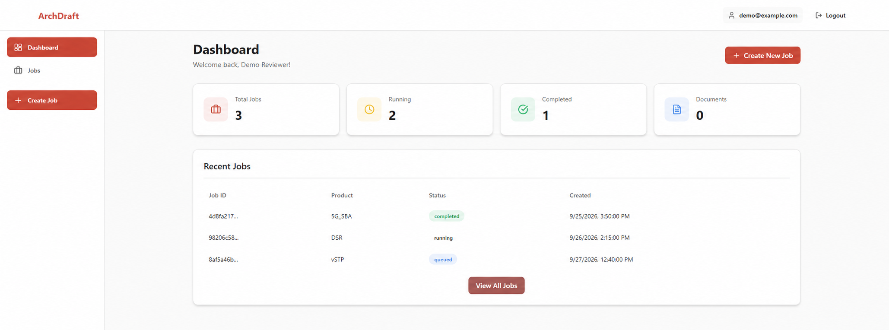
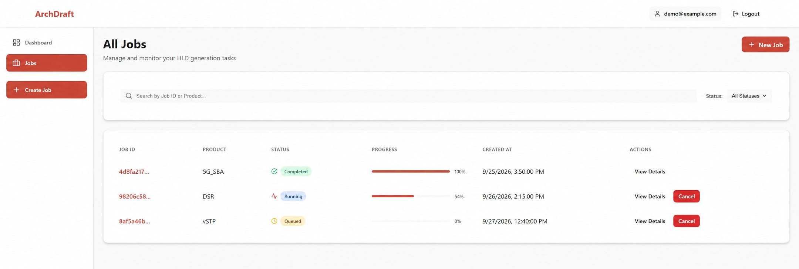
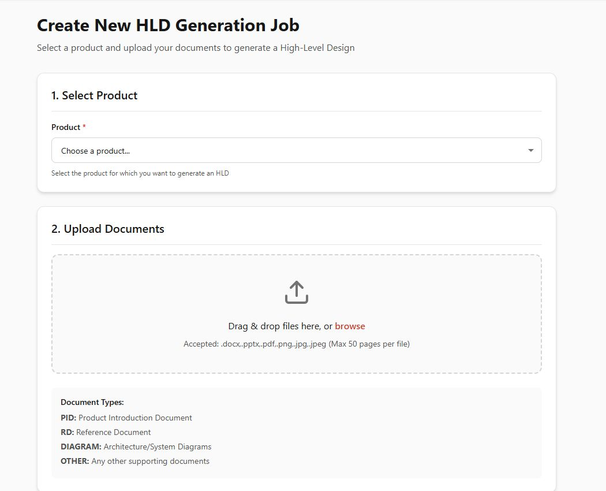
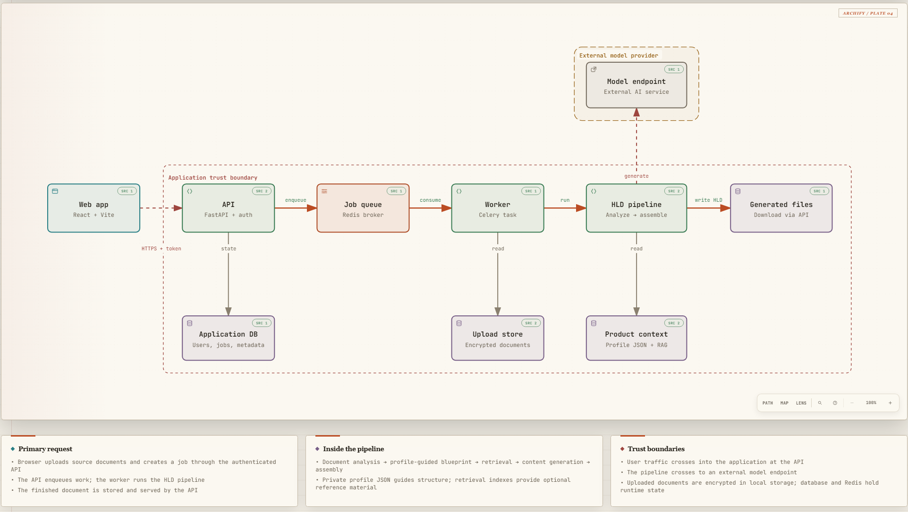

<div align="center">


# ArchDraft

**Turn source documents into a reviewable high-level design draft.**

Upload PDF or DOCX material, choose a configured product profile, follow the generation job, and download the assembled HLD.

[Explore the interface](#interface-preview) · [See the runtime architecture](#runtime-architecture) · [Create a product profile](docs/product-profiles.md) · [Run locally](#run-locally)

</div>

> [!NOTE]
> This is an experimental drafting tool. Generated technical claims need review against the source documents and current product specifications.

## Interface preview

The screenshots show the current frontend with **local sample responses**. They illustrate the interface, not a completed production generation run.

<p align="center">
  
</p>
<p align="center"><em>Dashboard — recent jobs, status, and quick access to a new HLD.</em></p>

<table>
  <tr>
    <td width="50%"><br /><strong>Track jobs</strong> — inspect progress and open completed work.</td>
    <td width="50%"><br /><strong>Start a draft</strong> — select a product and add source documents.</td>
  </tr>
</table>

## How it works

1. A signed-in user uploads source documents and starts a job from the web app.
2. FastAPI records the job and sends generation work to Redis and Celery.
3. The worker analyzes the documents, builds a blueprint, retrieves product context, generates sections, and assembles the HLD.
4. The API serves the generated file for review and download.

## Runtime architecture

<p align="center">
  <a href="docs/architecture/runtime-architecture.html"></a>
</p>

The main path runs left to right. The diagram keeps the database, encrypted uploads, private product profile, and external model service close to the components that use them. Its cards describe the pipeline and the two trust crossings without crowding the flow. [Download the standalone HTML diagram](docs/architecture/runtime-architecture.html) and open it locally for guided views and source links; the [diagram specification](docs/architecture/runtime-architecture.json) is versioned alongside it.

| Area | Code |
| --- | --- |
| Web interface | [`frontend/`](frontend/) — React, Vite, and TypeScript |
| API and job worker | [`backend/`](backend/) — FastAPI, SQL models, and Celery |
| Generation pipeline | [`orchestrator/`](orchestrator/) and [`agents/`](agents/) |
| Product profile format | [Creation guide](docs/product-profiles.md) and [`agents/blueprint/tools/product_profile_loader.py`](agents/blueprint/tools/product_profile_loader.py) |
| Shared integrations | [`shared/`](shared/) and [`external/`](external/) |

## Run locally

You need Python, Node.js, Redis, and credentials for the configured generative AI service. Some document processing packages may also need system libraries. The checked-in [environment template](backend/.env.example) lists the service, storage, and database settings.

1. Install the Python dependencies from the repository root:

   ```bash
   python -m venv .venv
   # Activate .venv using your shell's activation command.
   python -m pip install -r backend/requirements.txt -r requirements-production.txt
   ```

2. Copy `backend/.env.example` to `backend/.env`. Replace every placeholder, especially the signing key, encryption key, and model service settings. Keep the populated file private. [Create a product profile](docs/product-profiles.md) in the ignored `product_profiles/` directory before starting a generation job.

3. Start Redis, then run the API and worker in separate terminals from `backend/`:

   ```bash
   cd backend
   uvicorn main:app --host 127.0.0.1 --port 6602 --reload
   ```

   ```bash
   cd backend
   celery -A celery_app.celery_app worker --loglevel=info
   ```

4. Start the web app in another terminal:

   ```bash
   cd frontend
   npm ci
   npm run dev
   ```

Open `http://localhost:6601`. Vite proxies `/api` to the backend on port `6602`; API documentation is at `http://127.0.0.1:6602/api/docs`.

For a server deployment, `start_production.sh` binds the frontend and API to `127.0.0.1`. Publish the frontend through a TLS reverse proxy and keep the backend port private. Set the database and other deployment settings in `backend/.env` or the service environment. The script retains its root-directory SQLite location when no custom database URL is set.

The container image binds within its container network; place it behind the same TLS gateway and do not publish the API port directly. Existing completed jobs from earlier versions may need regeneration or a reviewed file migration before their downloads work with per-job storage.

For a direct pipeline run, use `python orchestrator/master_orchestrator.py <document.pdf> --product <product-id>` from the repository root. The selected product needs a matching private profile JSON. Retrieval data can be added separately for grounded product references.

## Data and review

Uploads, generated HLDs, databases, vector stores, credentials, and product profiles belong in local or deployment storage; they are not part of this repository. The example in the profile guide is fictional. Check generated statements and any new material before publishing or using an HLD.

For frontend changes, run `npm run type-check` and `npm run build` from `frontend/`. Python tests live under `tests/` and `backend/tests/` and require a configured Python environment.

## License

Original ArchDraft code and project documentation are licensed under the [Apache License 2.0](LICENSE). This permits use, modification, and distribution under its terms, including preservation of license notices.

No product profiles are bundled with the public repository. Third-party dependencies retain their own licenses, and product names remain the property of their respective owners. See [NOTICE](NOTICE) for the scope of this license.
